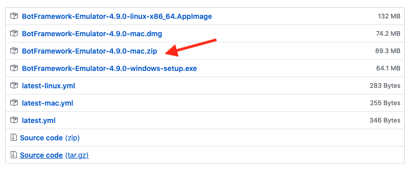
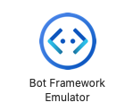
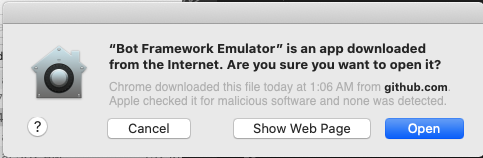
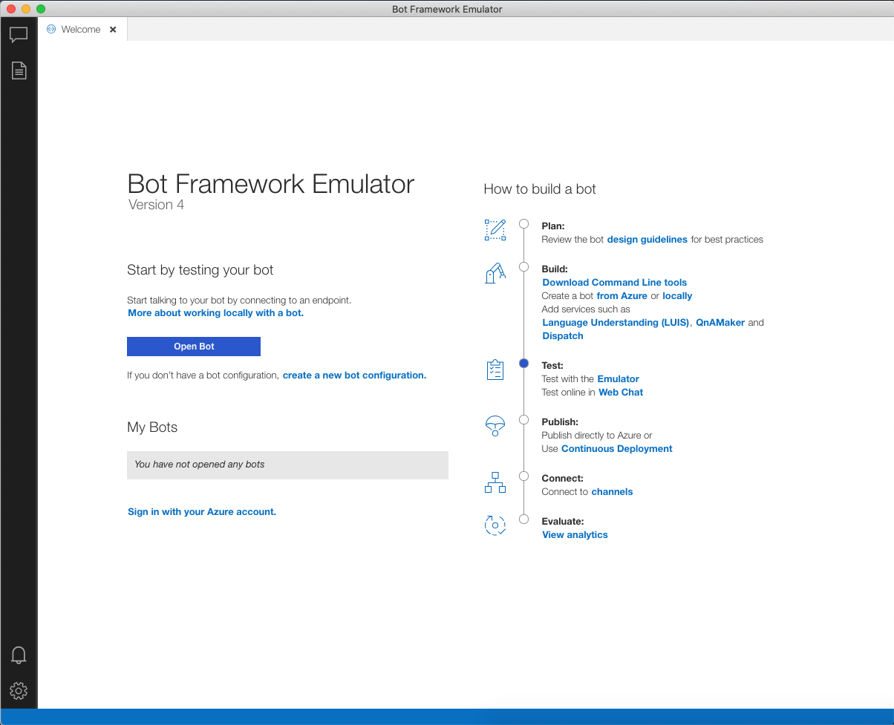

                                     ### INSTALL BOT FRAMEWORK EMULATOR ###

1.	Go to: https://github.com/Microsoft/BotFramework-Emulator/releases/tag/v4.9.0 

2.	Choose the right version for your OS, for Mac, choose the 3rd in the following image: 

 

3. Double click the downloaded zip file to finish installing Bot Framework Emulator, once done, you should see the an app with the following icon: 

 

4. Double click the icon to open Bot Framework Emulator application, if prompted, click 'Open':
 

5. Congratulations! You have successfully installed Bot Framework Emulator!

(for more information, visit Bot Framework Emulator Github repo: https://github.com/microsoft/botframework-emulator)

