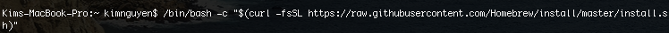
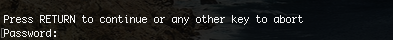
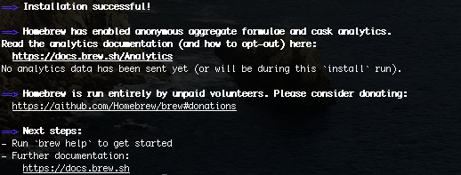

                                     ### INSTALL HOMEBREW ON MAC OS ###

1.	Open Terminal (Cmd + Space, search for "Terminal") 

2.	In Terminal, run the following command: 

/bin/bash -c "$(curl -fsSLhttps://raw.githubusercontent.com/Homebrew/install/master/install.sh)"

 

(for more information, visit homebrew homepage: https://brew.sh/)

3. When prompted, press ENTER and enter your device password (note: password does not show as typing) 

 

4. The installation might take several minutes. Once done, you should see similar message:
 

