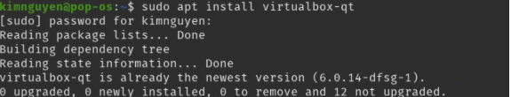
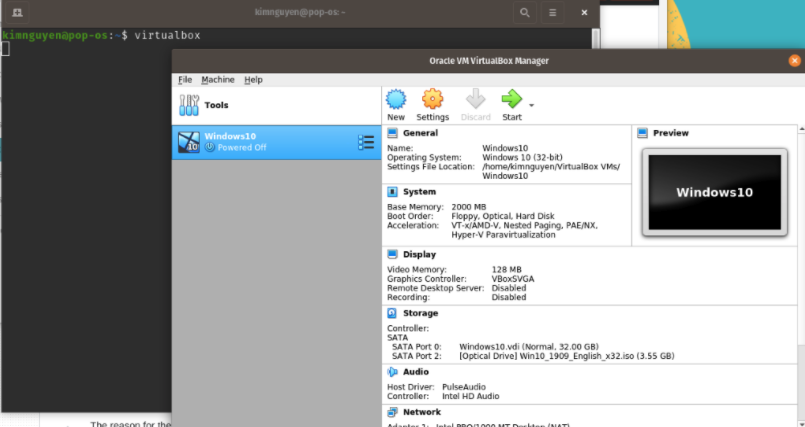
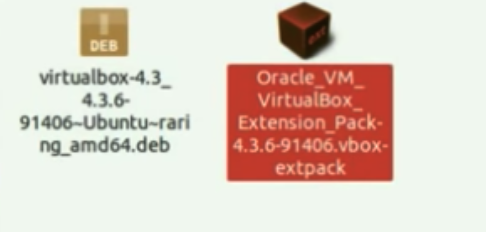
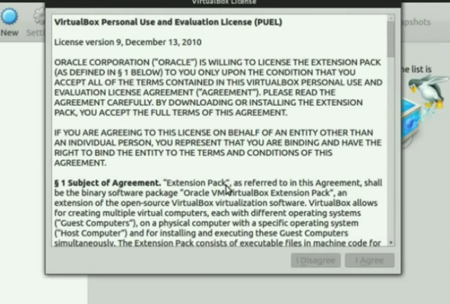
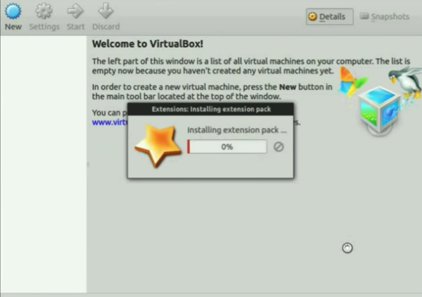

                                     ### INSTALL VIRTUAL BOX ON LINUX OS ###

VirtualBox is a piece of software published by Oracle. It allows you to emulate an operating system on your own PC and use it like it's running on real hardware. 

To install and configure Virtual Box, you can do that from Terminal using command line, or use the GUI, please choose one that fits your preference.  

### Option 1: Download and set up Virtual Box using command line ###

1. On your device, open Terminal (press the Super Key, search terminal)

2. In your terminal, type the following command and hit Enter: 

```sudo apt install virtualbox-qt```

 

If prompted to enter password, enter the password to log into your device then hit Enter (Note: The password will not show on the screen as you type) 

[Note: the installation message will be slightly different on your terminal, since I have already installed VM but you are installing for the first time] 

3. Once the installation is done, type the following commands: 

```sudo dpkg-reconfigure virtualbox-dkms``` 

 

```sudo dpkg-reconfigure virtualbox``` 


```sudo modprobe vboxdrv```


```sudo modprobe vboxnetflt```


4. At this point, your Virtual Box is installed and configured correctly, you can start using it right away. To open Virtual Box from terminal, type: 

```virtualbox```

Virtual Machine will be opened on your Desktop: 



[Note: Your VM might not show Windows10 as in the screenshot] 


### Option 2: Download and set up Virtual Box using GUI ###

1. Go to  https://www.virtualbox.org/wiki/Linux_Downloads and download the version that fits your current running operating system.  

2. Open Terminal (press the Super Key, search terminal), go to the folder where you save the downloaded file, type the following command: 

```sudo dpkg -i YourVirtualBoxFile``` 

[Note: replace YourVirtualBoxFile with the actual file name you downloaded] 

If prompt to enter password, enter the password to log into your device then hit Enter (Note: The password will not show on the screen as you type) 

3. After the package is installed, type the following command: 

```sudo adduser [YourName] vboxusers``` 

[Note: Replace YourName with a username you want, this step, we are creating a user for your virtual box] 

4. Go to the location you save the dowloaded file, look for VirtualBox_Extension_Pack icon, depends on you OS, the icon and name might look slightly different:  



5. Double click on the application, agree to the terms and condition:   

 

If prompt to enter password, enter the password to log into your device then hit Enter  

6. Installing will start immediately:  

 

7. Once the installation is done, click "OK", your virtual box is now ready to be used.  

Congratulations! You have successfully installed Virtual Box on your Linux ! 

