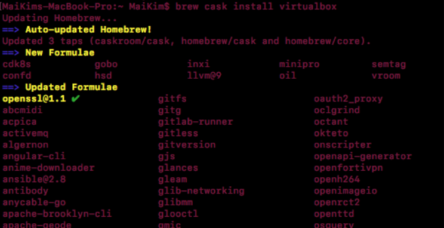
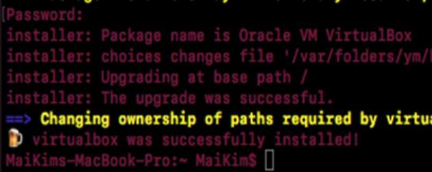
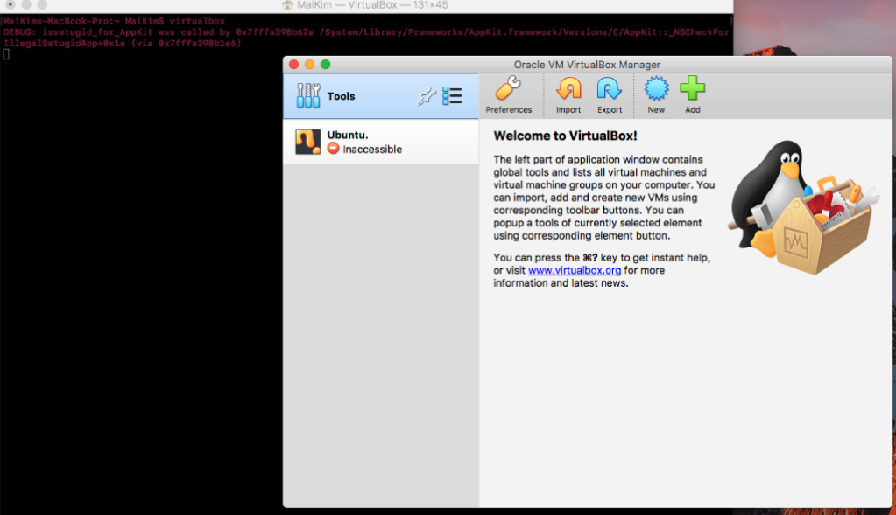
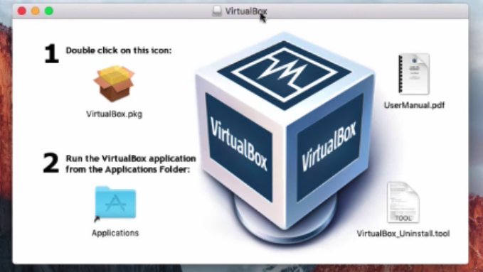
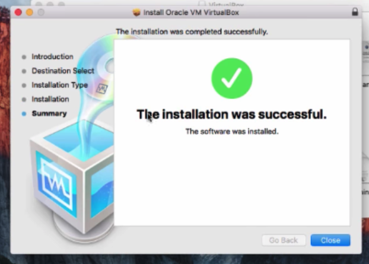

                                     ### INSTALL VIRTUAL BOX ON MAC OS ###

VirtualBox is a piece of software published by Oracle. It allows you to emulate an operating system on your own PC and use it like it's running on real hardware. 

To install and configure Virtual Box, you can do that from Terminal using command line, or use the GUI, please choose one that fits your preference.  

### Option 1: Download and set up Virtual Box using command line ###

### Youtube tutorial: https://youtu.be/vK0JV2Gfpvo ### 

1.	On your device, open Terminal (press the Cmd + Space, search terminal), type the command and hit Enter: 
(If you have not installed homebrew, install following this instruction: https://github.com/KimNguyenMai/Documentations/blob/master/Install%20Homebrew%20Guide.md) 

``` brew cask install virtualbox ```

If prompted to enter password, enter the password to log into your device then hit Enter (Note: The password will not show on the screen as you type) 



2.	Once the installation is done, you should see the "virtual box was successfully installed!" message:  

 

3. To open virtual box, type: 

```virtualbox ```

 


### Option 2: Download and set up Virtual Box using GUI ###

1. Go to https://www.virtualbox.org/wiki/Downloads and choose OS X hosts to download 
Once the package is downloaded, click to open, you should see a window as following: 



2. Click on the image under "1. Double click on the icon:", you should see a new window pops up:
 


3. Click Continue > Continue > Install > Enter your device password, the installation will begin. Once done, you should see: 



4. You can find VirtualBox under Applications, it is now ready to be used:  

 

Congratulations! You have successfully installed Virtual Box on your Mac ! 

